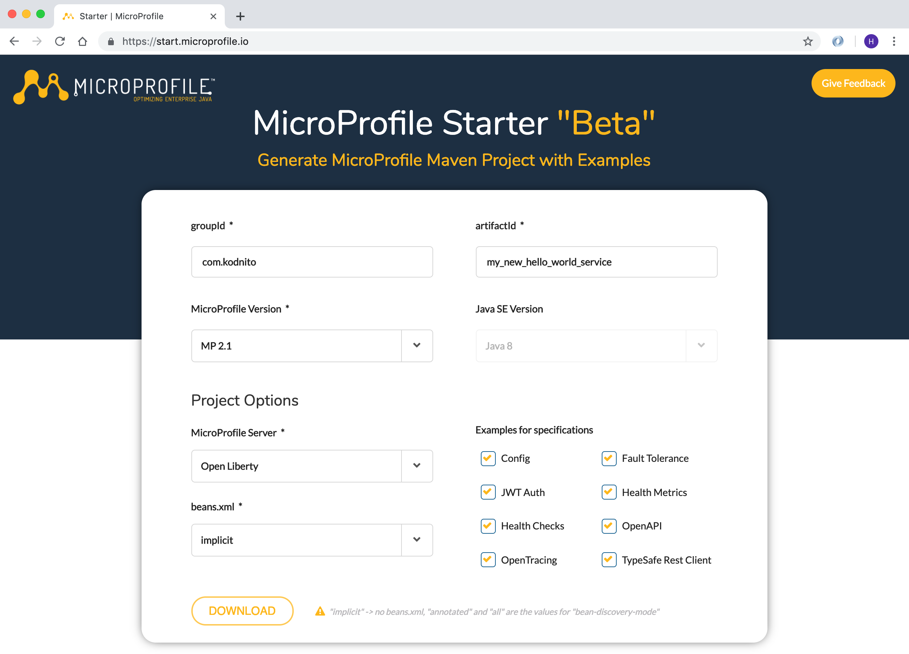

= Eclipse MicroProfile Starter

We used the Kodnito MicroProfile Archetype to generate our projects, but there is a new way and it's to use the new Eclipse MicroProfile Starter.
Go to https://start.microprofile.io and follow the steps below to generate your new application.

groupId: com.kodnito + 
artifactId: my_new_hello_world_service + 
MicroProfile Version: MP 2.1 + 
MicroProfile Server: Choose server + 
Choose Beans Discovery Mode + 
In Examples for specifications section, choose what examples you want to be generated.

That's it, now click Download button and your new project will be downloaded. + 
Unzip the zip file and open your terminal and go to the directory where the project is. + 
Depends on which server you choose, use one of the following commands to start the application. 

`Open Liberty`
[source, bash]
----
 mvn clean package && java -jar target/hello_microprofile_world.jar
----

`Thorntail`
[source, bash]
----
 mvn clean package && java -jar target/hello_microprofile_world-thorntail.jar
----

`Payara`
[source, bash]
----
 mvn clean package && java -jar target/hello_microprofile_world-microbundle.jar
----

`Apache TomEE`
[source, bash]
----
 mvn clean package && java -jar target/hello_microprofile_world-exec.jar
----

`KumuluzEE`
[source, bash]
----
 mvn clean package && java -jar target/hello_microprofile_world.jar
----

You will find the test page at http://localhost:8080/index.html

== Summary
In this chapter we learned how to use Eclipse MicroProfile Starter.