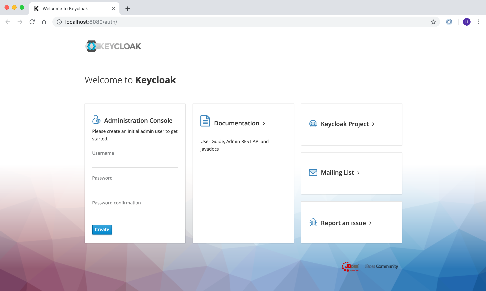
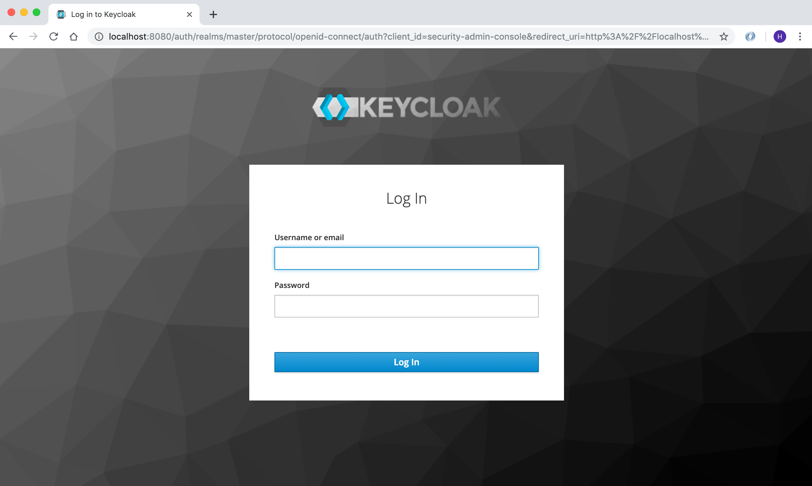
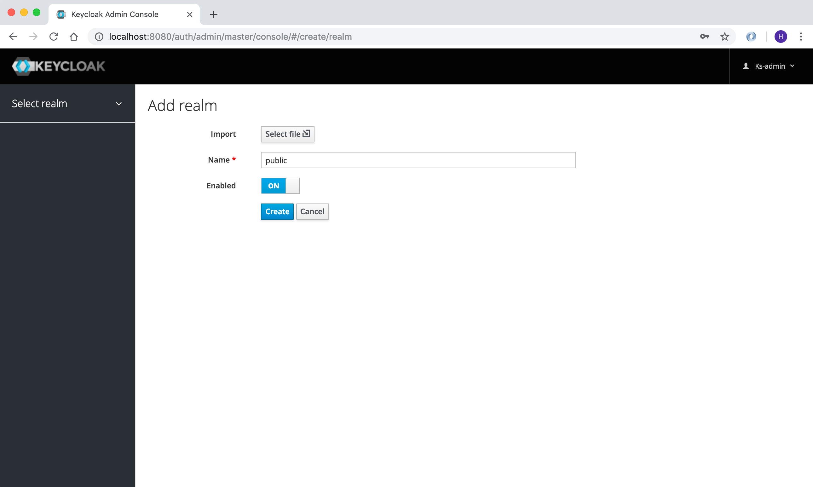
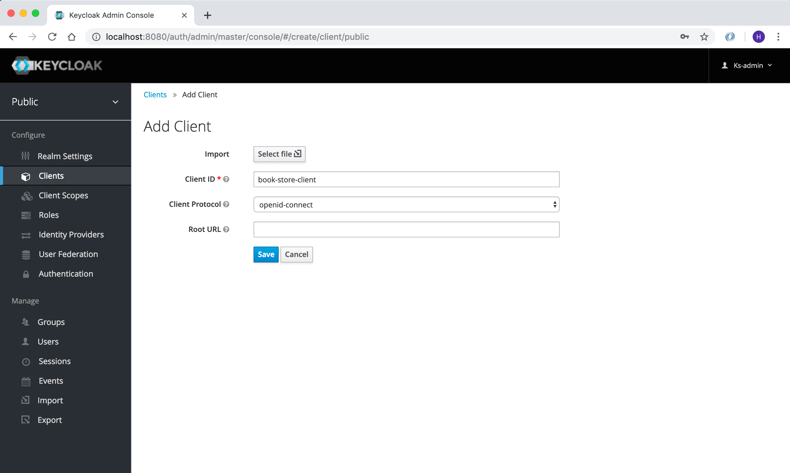
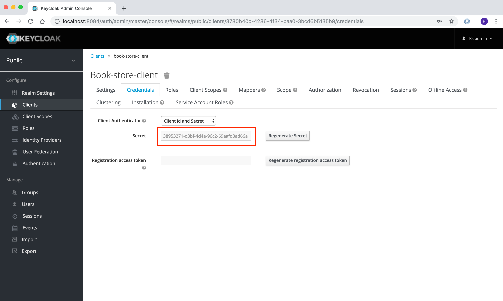

== MicroProfile JWT

In this chapter, we will learn how to secure our services using MicroProfile JWT and Keycloak.
Go to https://www.keycloak.org/downloads.html and download latest Standalone server distribution.
Unzip the zip file and open a new terminal window and navigate to the keycloak folder.
Now type following command to start the Keycloak server:

[source, bash]
----
./bin/standalone.sh -Djboss.http.port=8084
----

First thing we will do is to create a new user, 
open your browser and navigate to http://localhost:8084/auth/ and create a new user with admin access.

Now go to http://localhost:8084/auth/admin/ and login with the newly created user.

Click on Select Realm and click on Add Realm and create a new realm called public.

Now click on `Client` and create a new client called `book-store-client`, which we will use in our services.

Now, we need to create another user which will be used by our services.
Click on `Users` and create a new user called `book-store-client-user`.
Update the Email, First Name and Last Name fields and click Save.

image:../images/Keycloak-user-details.png[Keycloak User Details, 500,500]

Now click on `Credentials` and create a new password and click on Reset password, now we are done with the Keycloak setup for 
the user we will use.

Before we implement security in our services, we need to configure Keycloak.

* Click on `Groups` and create a new group called `mysimpleservice`

image:../images/keycloak-create-my-simple-group.png[Keycloak Client, 500,500]

* Click on `Users` and find the `book-store-client-user` and click on `Group` and click on the `mysimpleservice` and click `join`.

image:../images/keycloak-user-map-group.png[Keycloak Client, 500,500]
 
It's time to implement Keycloak authentication in our services.

Open `microprofile-config.properties` in `book-store-client` and add the following:

[source, properties]
----
mp.jwt.verify.publickey.location=/META-INF/keycloak-public-key.pem
mp.jwt.verify.issuer=http://localhost:8084/auth/realms/public
----

And create a new file called `keycloak-public-key.pem` inside `src/main/resources/META-INF` and store the public key.

[source, properties]
----
-----BEGIN PUBLIC KEY-----
MIIBIjANBgkqhkiG9w0BAQEFAAOCAQ8AMIIBCgKCAQEAmDmSR9FxmQdjy7lLColVAILD3Gxj8uV5O9PS32CbVNKC1pTh/LvUUigCq5SVVyLb8Ctw4wcC+Ax/AK0GgN76P6bEy9C3k22AqV8TZ7P41oPUSf7OhKBDHpPT2KBz/7tcNTaWHaJQu29ZnlIzqds+0EotjMAQCBU/wz/DwWesM0L/6nN99/mTtYm2ODoFBAyJkLH0x0wyaHPiFTWz+jxUsHYEEPaSFncsWrOY3M+x8AmeI63Wo8D6qTkgvDhjVq/zFTg2E0vb3d86X8sb1nYqLR4aInzQq+qzMFhUZQT9j/rgeLKdmneL8gYSiF4Yt0nPWBTygmwizYOU/86Db6cGawIDAQAB
-----END PUBLIC KEY-----
----

You find the public key here http://localhost:8084/auth/realms/public/

Now open the `ApplicationConfig.java` in `book-store-client` application and make it look like this:

[source, java]
----
@LoginConfig(authMethod = "MP-JWT")
@ApplicationPath("/")
@DeclareRoles({"mysimplerole", "ADMIN"})
public class ApplicationConfig extends Application {

}
----

`@LoginConfig` annotation describe what associated realm name will be used in the application. +
`@DeclareRoles` annotation is used to declare security roles. +

Now open the `BookStoreEndpoint.java` file and add `@RolesAllowed("mysimplerole")` to the `mpConfig()` method.

[source, java]
----
@GET
@Path("mp-config")
@Produces(MediaType.APPLICATION_JSON)
@RolesAllowed("mysimplerole")
public Response mpConfig() {
    Map<String, Object> configProperties = new HashMap<>();

    configProperties.put("username", username);
    configProperties.put("password", config.getValue("password", String.class));
    configProperties.put("microprofile-apis", config.getValue("microprofile.apis", String[].class));

    return Response.ok(configProperties).build();
}
----

`@RolesAllowed` annotation is used to declare security roles and specifies a list of roles to access methods in the application.

Download https://twitter.com/cicekhayri[Postman], if you don't already have it installed.
We will now invoke the Keycloak auth token endpoint to retrieve the access token to use in our service.
Open Postman and add the following to retrieve access token.

image:../images/postman-keycloak-token-endpoint.png[Keycloak Client, 500,500]

POST: http://localhost:8084/auth/realms/public/protocol/openid-connect/token +
realm: public +
grant_type: password +
client_id: book-store-client +
username: the_username_of_the_user +
password: the_password_of_the_user +
client_secret: the book store client secret +
You find this in the `Credentials` menu.

Now click on `Send` and you will retrieve access token. Copy the access token and open a new Postman tab.
Now, make an `GET` request to `http://localhost:8081/restapi/books/mp-config`, if you don't send the request with access token,
you will get `401 Unauthorized`. +
In `Type` dropdown menu, choose `Bearer Token` and paste the token in `Token` field. +
Now click on `Send` again and you will now get `200 OK`.

image:../images/postman-auth-200-OK.png[Keycloak Client, 500,500]

And that's it, we have secured our `/mp-config` endpoint.

=== Summary

In this chapter, we learned how to add MicroProfile JWT security to our service.