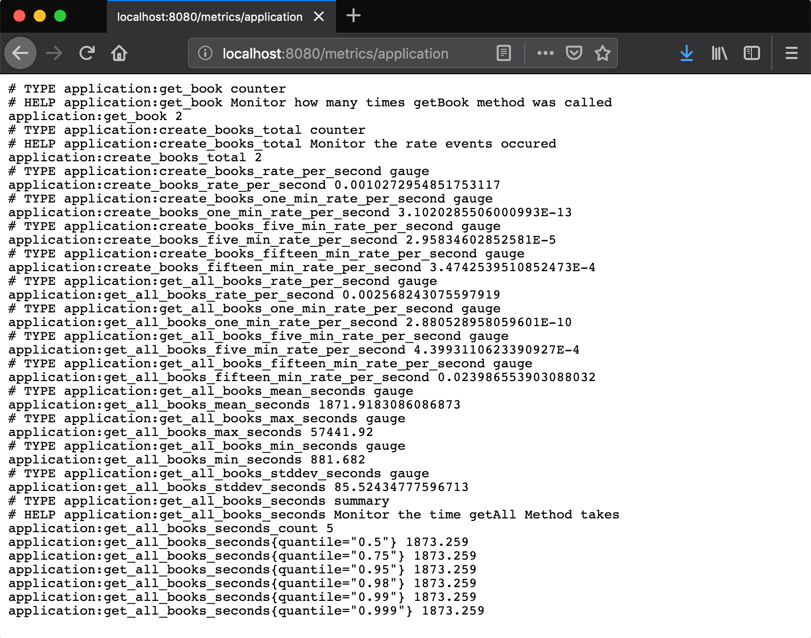

= MicroProfile Metrics

When we build micro services or web applications, we need to monitor our application that it’s running, have memory or disk space and for that we have MicroProfile Metrics which is very easy to get started with and use.
Open the BookStoreEndpoint.java file and make the getAll method to look like this.

[source, java]
----
@Timed(name = "getAllBooks",
            description = "Monitor the time getAll Method takes",
            unit = MetricUnits.MILLISECONDS,
            absolute = true)
@GET
public Response getAll() {
        return Response.ok(bookService.getAll()).build();
}
----

`@Timed` annotation will monitor how long the process take. 
The metadata fields on `@Timed` annotation are optional, but we have added a few name field is the name of the metric, description is used to describe the metric, unit sets the the unit of the metric and absolute is used to determine if the name specified in the name field is the exact name. 
Now Kill the Payara Micro server and start it again using the command `mvn clean package payara-micro:start` and first navigate to the http://localhost:8080/restapi/books, because we need to time it and se how long the process will take, now open another tab and go to http://localhost:8080/metrics/application and voila you have some metrics.

Here we have a list of metrics and if we want a single metric then we could use the name we specified in the name field and navigate to http://localhost:8080/metrics/application/get-all-books.

== `@Metered`
`@Metered` annotation will monitor the rate events occured. The metafields are optional, but it makes the life easy if we add some data to the metafields. Change the create method to look like this.

[source, java]
----
@Metered(name = "create-books",
            unit = MetricUnits.MILLISECONDS,
            description = "Monitor the rate events occured",
            absolute = true)
@POST
public Response create(Book book) {
        bookService.create(book);
        return Response.ok().build();
}
----

Like the `@Timed` annotation, we have name, unit, description and absolute, which is almost identical.

== `@Counted`
`@Counted` annotation will monitor how many times a method got invoked, and the `@Counted` annotation have a few metafields and are optional. Update the getBook method to look like this.

[source, java]
----
@Counted(unit = MetricUnits.NONE,
            name = "getBook",
            absolute = true,
            monotonic = true,
            displayName = "get single book",
            description = "Monitor how many times getBook method was called")
@GET
@Path("{id}")
public Response getBook(@PathParam("id") Long id) {
        Book book = bookService.findById(id);

        return Response.ok(book).build();
}
----

Here, like the other metrics, we have name, absolute, monotonic, displayName and description, the table below show what everything is for:

[width="100%"]
|========================================================
|unit           |sets the unit of the metric.
|absolute       |is used to determine if the name specified in the name field is the exact name.
|monotonic      |is set to true, which means the counter increases monotonically.
|displayName    |the display name of the counter
|description    |describe the metric
|========================================================

== `@Gauge`
`@Gauge` annotation is used to return just a value
The metadata fields on @Counted annotation are optional

Example:

[source, java]
----
@GET
@Path("/get-int-value")
@Gauge(unit = MetricUnits.NONE, name = "intValue", absolute = true)
public int getIntValue() {
        return 3;
}
----

[width="100%"]
|========================================================
|unit       |sets the unit of the metric.
|name       |the name of the gauge.
|absolute   |is used to determine if the name specified in the name field is the exact name.
|========================================================

Start the application server and go to http://localhost:8080/metrics/application, you should see all your metrics. 

== Summary
In this chapter, we learned how to add MicroProfile Metrics to our application.