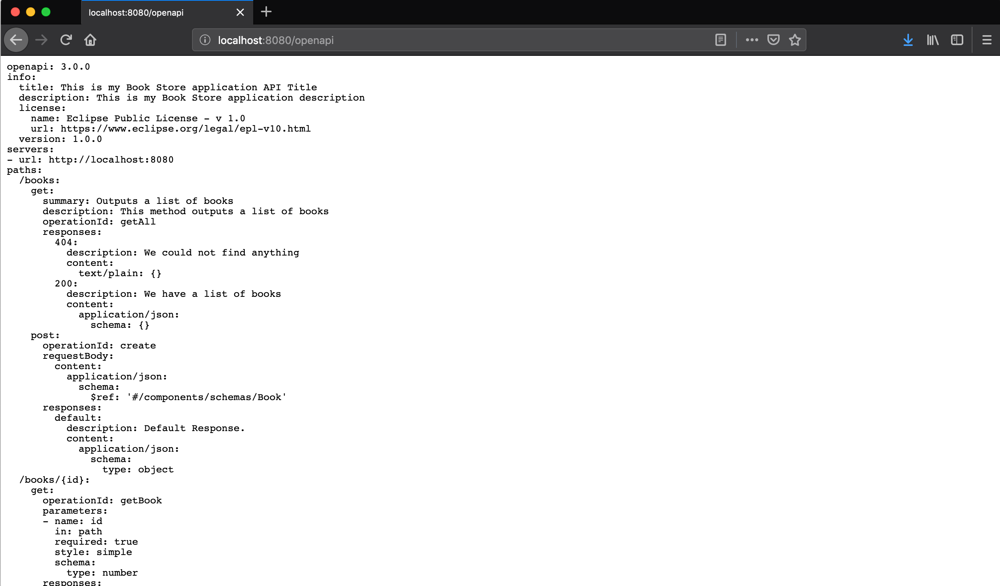

= MicroProfile Open API

In this chapter, we will learn how to document our RESTful APIs.
MicroProfile OpenAPI defines interfaces to produces OpenAPI documentation from JAX-RS applications.
We will add documentation to our `book-store` service application.
Inside `src/main/resources/META-INF` create the `openapi.yaml` file and add the following :

[source, yaml]
----
openapi: 3.0.0
info:
  title: This is my Book Store application API Title
  description: This is my Book Store application description
  license:
    name: Eclipse Public License - v 1.0
    url: https://www.eclipse.org/legal/epl-v10.html
  version: 1.0.0
servers:
- url: http://localhost:8080
----

This is our configuration for our API documentation, here we add title, description and license if we want.
Restart the `book-store` application and go to http://localhost:8080/openapi and you will se your RESTful API documentation generated, it doesn’t say much about the endpoint and we can add more to the generated documentation.
Open `BookStoreEndpoint.java` and make the `getAll()` method to look like this:

[source, java]
----
@APIResponses(
        value = {
            @APIResponse(
                    responseCode = "404",
                    description = "We could not find anything",
                    content = @Content(mediaType = "text/plain"))
            ,
    @APIResponse(
                    responseCode = "200",
                    description = "We have a list of books",
                    content = @Content(mediaType = "application/json",
                            schema = @Schema(implementation = Properties.class)))})
@Operation(summary = "Outputs a list of books",
        description = "This method outputs a list of books")
@Timed(name = "get-all-books",
        description = "Monitor the time getAll Method takes",
        unit = MetricUnits.MILLISECONDS,
        absolute = true)
@GET
public Response getAll() {
    return Response.ok(bookService.getAll()).build();
}
----

restart the `book-store` service and refresh the http://localhost:8080/openapi endpoint and se the new generated OpenAPI documentation.

`@APIResponses` annotation describes multiple responses
`@APIResponse` annotation describes a single response
`@Operation` annotation describes a single operation on a path
`@Parameter` annotation describes a single operation parameter

https://www.phillip-kruger.com[*Phillip Krüger*] have an excellent blog post on how to add Swagger UI to your OpenAPI documentation. 
https://www.phillip-kruger.com/post/microprofile_openapi_swaggerui/

== Summary

In this chapter, we learned how to document our RESTful APIs using MicroProfile OpenAPI.
